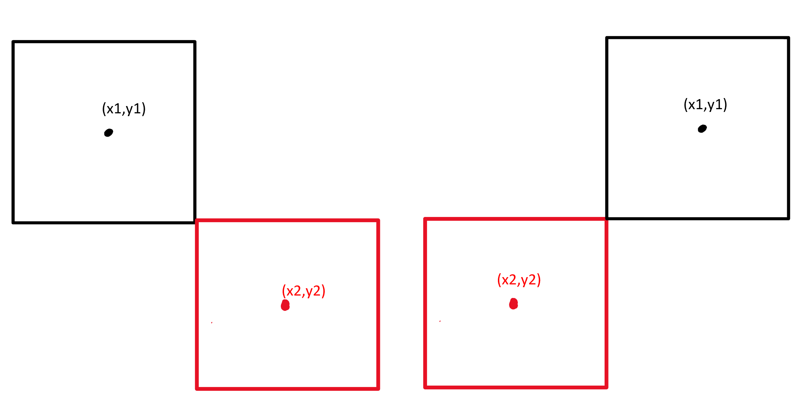

## 1.滚动的陆地

### 1.1加载路面


```python
import turtle
import random
turtle.setup(600,400)
turtle.hideturtle()
turtle.tracer(False)
#路面
ground = turtle.Turtle()
turtle.addshape('ground.gif')
ground.shape('ground.gif')
ground.up()
turtle.done()
```

### 1.2让路面动起来

'ground.gif'是由两张一样的600\*19的图片拼接而成，移动的路面的原理是，让图片向左移动1200像素点后，传送回原始位置。这样就看不出倒退的痕迹


```python
#draw()函数用来控制所有的绘图的程序
def draw():
    turtle.clear()
    ground.goto(g[0],g[1])
    turtle.update()

#定义move()函数用来用来控制所有的坐标移动
def move():
    g[0] -= 10  #让地面的坐标不断减小
    if g[0] == -600: #当地面从600到达-600，正好走完一圈
        g[0] = 600 #回到初始位置，类似跑步机
    draw()
    turtle.ontimer(move,50)

g = [600,0] #初始位置
move()
```

## 2.添加小恐龙

### 2.1加载小恐龙


```python
#小恐龙
turtle.addshape('dino1.gif')
dinosaur = turtle.Turtle()
dinosaur.shape('dino1.gif')
dinosaur.up()
di = [-200,15] #小恐龙初始位置 
```

### 2.2 修改move()函数


```python
def draw():
    turtle.clear()
    ground.goto(g[0],g[1])
    dinosaur.goto(di[0],di[1]) #将小恐龙的画笔移动到起始位置
    turtle.update()
```

## 3.添加奔跑的小恐龙

### 3.1 将所有的图片加载到turtle图标库


```python
imgs = ['dino1.gif','dino2.gif','dino3.gif','dino4.gif','dino_down1.gif','dino_down2.gif','bird1.gif','bird2.gif','ground.gif','cactus.gif']
for img in imgs:
    turtle.addshape(img)
#这里可以删除之前写的两个addshape()指令
```

### 3.2 修改move()函数，添加小恐龙动画


```python
#定义state字典变量
state = {'count':0} 
#之所以不直接用变量，是为了避免在函数中无法使用局部变量
```


```python
def draw():
    turtle.clear()
    state['count'] += 1 #让'count'对应的值不断增加
    ground.goto(g[0],g[1])
    dinosaur.shape('dino'+str(state['count']%3+1)+'.gif') #dino4.gif是死亡时的图片
    dinosaur.goto(di[0],di[1])
    turtle.update()
```

## 4.让小恐龙跳起来

### 4.1 添加触发函数和监控空格键按下


```python
def tap():
    di[1] += 90
    
def move():
    #snip
    if di[1] >= 15:
        di[1] -= 5
    #snip
turtle.listen()
turtle.onkeypress(tap,'space')
```

### 4.2添加判断跳跃的状态参数，已经跳起时，不会再次起跳


```python
state = {'count':0,'jump':0}#jump的值是否为0表示是否已经起跳
```


```python
def tap():
    if state['jump'] == 0:
        di[1] += 90
        state['jump'] = 1
def move():
    if di[1] >= 15:
        di[1] -= 5
    else: #落回地面后状态归零
        state['jump'] = 0
    #snip
```

### 4.3进行仿真，起跳慢慢上升

    #向上跳， di[1] += 16*正数
    #向下落   di[1] += 16*负数
    #不跳     di[1] += 16*0
我们可以认为，使用状态量state\['jump'\]来表示向上（正数），向下（负数）和不跳的状态（0），di\[1\]每次的增量为16\*state\['jump'\]。

为了添加重力感，向上跳的时候，让状态量state\['jump'\]逐渐减小，减小到0后变为负数，继续减小后落到地面为止，重新变为0。


```python
def tap():
    if state['jump'] == 0:
        state['jump'] = 2 #改变这个数字可以控制起跳高度

def jump():
    di[1] += 16*state['jump']
    if di[1] > 15: #di>15表示现在一定是跳起来的状态，不论向上还是向下
        state['jump'] -= 0.4 #起跳过程中，让state['jump']逐渐减小
    else: #落回地面
        state['jump'] = 0 #状态清零
        di[1] = 15 #修正di的纵坐标为初始地面高度
```


```python
def move():
    jump() #在move中调用jump()
    g[0] -= 10
    if g[0] == -600:
        g[0] = 600
    draw()
    turtle.ontimer(move,50)
```

## 5.添加仙人掌

### 5.1练习：仿写ground的对象程序，添加一个仙人掌的画笔对象，并让它从屏幕最右侧向左侧移动


```python
#仙人掌
cactus = turtle.Turtle()
cactus.shape('cactus.gif')
cactus.up()
c = [300,15]
```


```python
def draw():
    turtle.clear()
    state['count'] += 1
    ground.goto(g[0],g[1])
    cactus.goto(c[0],c[1]) #让仙人掌移动
    dinosaur.shape('dino'+str(state['count']%3+1)+'.gif')
    dinosaur.goto(di[0],di[1])
    turtle.update()
```


```python
def move():
    jump()
    c[0] -= 10 #仙人掌坐标变换
    g[0] -= 10
    if g[0] == -600:
        g[0] = 600
    draw()
    turtle.ontimer(move,50)
```

### 5.2 生成多个仙人掌


```python
#仙人掌
cacti = {}  #这个字典中的key是每一个仙人掌画笔，value是这些画笔的横坐标
```


```python
def draw():
    turtle.clear()
    state['count'] += 1
    ground.goto(g[0],g[1])
    if random.randint(1,20) == 1:  #5%的概率会生成新仙人掌
        cactus = turtle.Turtle()
        cactus.shape('cactus.gif')
        cactus.up()
        cacti[cactus] = 300 #将画笔cactus和它的初始横坐标300添加到字典cacti中
    for cactus,x in cacti.items(): #循环cacti，让每个画笔移动
        cactus.goto(x,15)
    dinosaur.shape('dino'+str(state['count']%3+1)+'.gif')
    dinosaur.goto(di[0],di[1])
    turtle.update()
```


```python
def move():
    jump()
    for cactus in cacti.keys():#循环cacti，让每个画笔的横坐标减小
        cacti[cactus] -= 10
    #snip
```

### 5.3 让仙人掌之间的距离不要太近

通过list(cacti.values())\[-1\]获取字典中最后一个仙人掌的横坐标，判断它与屏幕右侧之间的距离是否足够大


```python
def draw():
    turtle.clear()
    state['count'] += 1
    ground.goto(g[0],g[1])
    # cacti为空，或者cacti中最后一个仙人掌的横坐标小于100，这时可以生成新的新的仙人掌
    #通过修改最后一个条件的数字，可以控制游戏难度，数字越接近300越难
    #注意and or的优先级问题
    if random.randint(1,20) == 1 and (cacti == {} or list(cacti.values())[-1] < 100):
        cactus = turtle.Turtle()
        cactus.shape('cactus.gif')
        cactus.up()
        cacti[cactus] = 300
```

## 6.判断碰撞

小恐龙图片大小为40\*50,仙人掌高度20\*40

临界情况，恰好左侧或右侧碰撞,则|x1-x2|为两个矩形宽度之和的一半，|y1-y2|为高度之和的一半。所以如果|x1-x2|<=(40+20)/2并且|y1-y2|<=(50+40)/2,则说明两张图相交，也就是发生了碰撞。
**注意：因为图片有白边，数字可以酌情减少一些**



```python
def move():
    jump()
    for cactus in cacti.keys():
        if abs(di[0]-cacti[cactus]) <= 20 and abs(di[1] - 15) <= 35:
            return False
        cacti[cactus] -= 10
    #snip
```

## 7.添加小恐龙死亡状态

死亡的图片是dino4.gif,给draw()添加一个参数控制图片切换


```python
def draw(alive):
    #snip
    if alive == True:
        dinosaur.shape('dino'+str(state['count']%3+1)+'.gif')
    else:
        dinosaur.shape('dino4.gif')
    dinosaur.goto(di[0],di[1])
    turtle.update()
```

发生碰撞时再次执行draw()函数，同时传递False参数


```python
def move():
    jump()
    for cactus in cacti.keys():
        if abs(di[0]-cacti[cactus]) <= 20 and abs(di[1] - 15) <= 35: 
            draw(False)
            return False
        cacti[cactus] -= 10
    g[0] -= 10
    if g[0] == -600:
        g[0] = 600
    draw(True)
    turtle.ontimer(move,50)
```

## 8 添加蹲下动作

### 8.1绑定下蹲的按键和触发函数

添加状态量，并且编写onkeypress()和onkeyrelease()函数，用来分别控制按下"Down"让小恐龙蹲下，抬起"Down"让小恐龙重新站起来


```python
#11
def dino_down():
    state['down'] = 1
#11
def dino_up():
    state['down'] = 0

state = {'count':0,'jump':0,'down':0}
turtle.onkeypress(dino_down,'Down')
turtle.onkeyrelease(dino_up,'Down')
```

### 8.2 练习：修改draw()函数，添加条件，通过state\['down'\]作为条件，切换dinosaur的图形


```python
def draw(alive):
    #snip
    if alive == True:
        if state['down'] == 0:
            dinosaur.shape('dino'+str(state['count']%3+1)+'.gif')
        else:
             dinosaur.shape('dino_down'+str(state['count']%2+1)+'.gif')
    else:
        dinosaur.shape('dino4.gif')
    dinosaur.goto(di[0],di[1])
    turtle.update()

```

## 9.添加小鸟对象

### 9.1创建bird画笔


```python
bird = turtle.Turtle()
bird.shape('bird1.gif')
bird.up()
b = [310,20]
```

### 9.2让小鸟在屏幕上移动

与cactus不同，bird从始至终只有一个画笔对象，当bird从屏幕右侧不断向左侧飞的过程中，坐标b\[0\]不断减少，直到飞出左侧边界，让b\[0\]的值重新被赋值为初始坐标，这样就将bird传送回初始位置，继续从右向左飞。


```python
def draw(alive):
    #snip
    bird.shape('bird'+str(state['count']%2+1)+'.gif')
    bird.goto(b[0],b[1])
    turtle.update()
```


```python
def move():
    #snip
    b[0] -= 10
    if b[0] <= -310:
        b[0] = 310
        b[1] = random.randint(20,80)
    draw(True)
    turtle.ontimer(move,50)
```

### 9.3 添加条件控制bird出现的频率

在state中添加新的状态量控制bird是向前飞还是待机，同时添加条件控制飞鸟与仙人掌之间的距离


```python
def draw(alive):
    turtle.clear()
    state['count'] += 1
    ground.goto(g[0],g[1])
    #后两个条件保证已经在屏幕中的飞鸟距离屏幕右边界足够远，或者飞鸟还没起飞
    if random.randint(1,20) == 1 and (cacti == {} or list(cacti.values())[-1] < 100) and (b[0] < 100 or state['bird'] == 0): 
        cactus = turtle.Turtle()
        cactus.shape('cactus.gif')
        cactus.up()
        cacti[cactus] = 300
    #第一个条件降低概率，后两个条件保证最后一个仙人掌距离飞鸟足够远
    elif random.randint(1,50) == 50 and (cacti == {} or list(cacti.values())[-1] < 100):
        state['bird'] = 1
    # snip
```


```python
def move():
    #snip
    if state['bird'] == 1:#####
        b[0] -= 10
    if b[0] <= -310:
        b[0] = 310
        b[1] = random.randint(20,80)
        state['bird'] = 0#####
    draw(True)
    turtle.ontimer(move,50)
```

## 10 判断小鸟和恐龙碰撞

原理与仙人掌的碰撞类似


```python
def move():
    jump()
    for cactus in cacti.keys():
        if abs(di[0]-cacti[cactus]) <= 20 and abs(di[1] - 15) <= 35: 
            draw(False)
            return False
        cacti[cactus] -= 10
    if abs(di[0]-b[0]) <= 25 and abs(di[1] - b[1]) <= 20:
        draw(False)
        return False
    #snip
```

## 11. 添加音乐

### 11.1 安装pygame模块


```python
pip install pygame #win
pip3 install pygame #mac
```

### 11.2添加音乐


```python
import pygame
pygame.init()
jump_sound = pygame.mixer.Sound('jump.wav')
death_sound = pygame.mixer.Sound('die.wav')
```


```python
def tap():
    if state['jump'] == 0:
        state['jump'] = 2
        jump_sound.play()#####
```


```python
def draw(alive):
    #snip
    if alive == True:
        if state['down'] == 0:
            dinosaur.shape('dino'+str(state['count']%3+1)+'.gif')
        else:
             dinosaur.shape('dino_down'+str(state['count']%2+1)+'.gif')
    else:
        death_sound.play()#####
        dinosaur.shape('dino4.gif')
    dinosaur.goto(di[0],di[1])
    bird.shape('bird'+str(state['count']%2+1)+'.gif') 
    bird.goto(b[0],b[1]) 
    turtle.update()
```

## 12.添加分数

添加新的状态量score,并使用turtle画笔在右上角write分数


```python
state = {'count':0,'jump':0,'down':0,'bird':0,'score':0}
turtle.setup(600,400)
turtle.hideturtle()
turtle.up()
turtle.goto(100,150)
```


```python
def draw(alive):
    #snip
    state['score'] += 1
    turtle.write('分数：'+str(state['score']),font = ('',30,''))
    turtle.update()
```

## 拓展，自由发挥

例如，添加重新开始功能，每增加100分难度增加，等待
